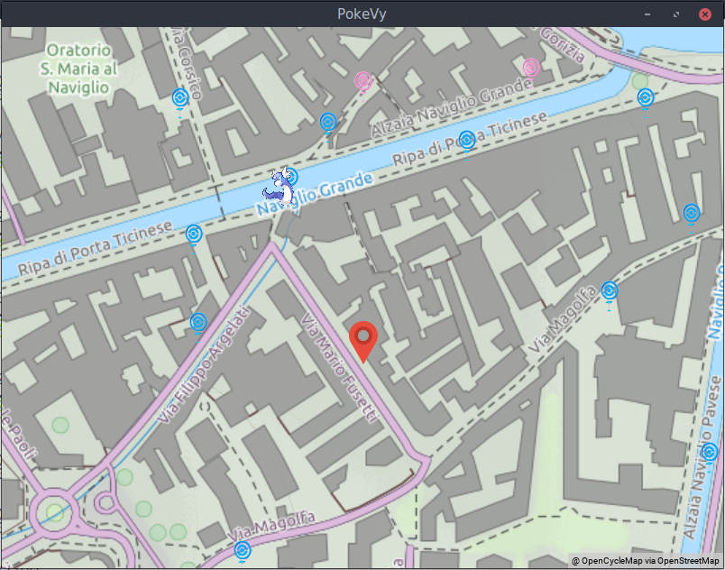

# PokeVy

A  front-end for [PokemonGo-Bot](https://github.com/PokemonGoF/PokemonGo-Bot).



## Requirements

Download all the requirements for PokemonGo-Bot and install them. Make sure you get it running. Use [my fork](https://github.com/Davideddu/PokemonGo-Bot) until they merge my pull-request. It won't work without it.

Download and install [Kivy](http://kivy.org) and [Kivy Garden](https://kivy.org/docs/api-kivy.garden.html).

You can install both of them using `pip`:

```
# pip install kivy kivy-garden
```

Then you need to install `garden.mapview`

```
$ garden install mapview
```

Copy PokeVy's sample configuration file `config.py.example` to `config.py`, then edit it: add your username and the location of PokemonGo-Bot. Make sure the path is absolute.

Awesome! You're ready to use PokeVy! Just start PokemonGo-Bot as usual, then run `python main.py`.

## Troubleshooting

### "last-location-(username).json - No such file or directory"

For some reason, PokemonGo-Bot does not write to that file unless it already exists. Just create it.

`cd` to PokemonGo-Bot's path and run `touch data/last-location-(username).json`, replacing `(username)` with your username.